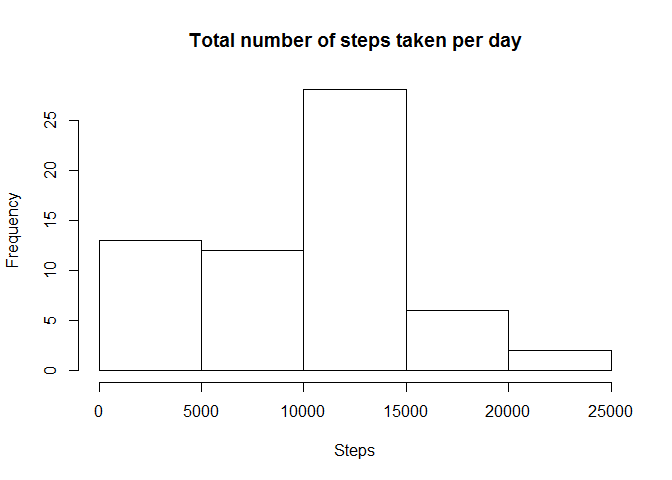
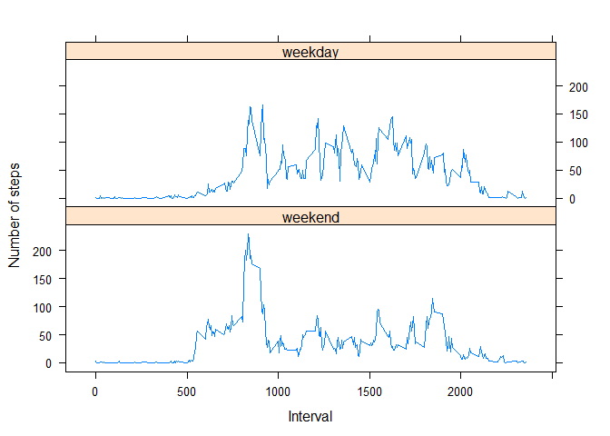

# Reproducible Research: Peer Assessment 1


## Loading and preprocessing the data

```r
 data <- read.csv("activity.csv")
 str(data)
```

```
## 'data.frame':	17568 obs. of  3 variables:
##  $ steps   : int  NA NA NA NA NA NA NA NA NA NA ...
##  $ date    : Factor w/ 61 levels "2012-10-01","2012-10-02",..: 1 1 1 1 1 1 1 1 1 1 ...
##  $ interval: int  0 5 10 15 20 25 30 35 40 45 ...
```

```r
 head(data)
```

```
##   steps       date interval
## 1    NA 2012-10-01        0
## 2    NA 2012-10-01        5
## 3    NA 2012-10-01       10
## 4    NA 2012-10-01       15
## 5    NA 2012-10-01       20
## 6    NA 2012-10-01       25
```


## What is mean total number of steps taken per day?

```r
daily_total_steps <- aggregate(data["steps"], by=list(date=data$date), 
                               FUN=sum, na.rm=TRUE)

hist(daily_total_steps$steps, main="Total number of steps taken per day", 
     xlab= "Steps")
```

 

Mean of the total number of steps taken per day

```r
mean(daily_total_steps$steps, na.rm=TRUE)
```

```
## [1] 9354.23
```

Median of the total number of steps taken per day

```r
median(daily_total_steps$steps, na.rm=TRUE)
```

```
## [1] 10395
```


## What is the average daily activity pattern?

```r
average_steps_by_interval <- aggregate(data["steps"],
                                       by=list(interval=data$interval), 
                                       FUN=mean, na.rm=TRUE)
plot(x=average_steps_by_interval$interval, y=average_steps_by_interval$steps,
     type="l", xlab="Interval", ylab="Average steps")
```

 

Interval which contains maximum number of steps

```r
average_steps_by_interval[which.max(average_steps_by_interval$steps),]$interval
```

```
## [1] 835
```


## Imputing missing values

Total number of missing values in the dataset

```r
sum(!complete.cases(data))
```

```
## [1] 2304
```

Imputing missing values with the mean for that interval


```r
data2 = data

for (i in seq_len(nrow(data2))) {
    if(is.na(data2[i, "steps"]))
data2[i, "steps"] <- average_steps_by_interval[average_steps_by_interval$interval==data2[i, "interval"],"steps"]
}
```

New dataset with the missing data filled in.

```r
head(data2)
```

```
##       steps       date interval
## 1 1.7169811 2012-10-01        0
## 2 0.3396226 2012-10-01        5
## 3 0.1320755 2012-10-01       10
## 4 0.1509434 2012-10-01       15
## 5 0.0754717 2012-10-01       20
## 6 2.0943396 2012-10-01       25
```


```r
daily_total_steps2 <- aggregate(data2["steps"], by=list(date=data$date), 
                               FUN=sum)

hist(daily_total_steps2$steps, main="Total number of steps taken per day", 
     xlab= "Steps")
```

 

Mean of the total number of steps taken per day after imputing missing data

```r
mean(daily_total_steps2$steps)
```

```
## [1] 10766.19
```

Median of the total number of steps taken per day after imputing missing data

```r
median(daily_total_steps2$steps, na.rm=TRUE)
```

```
## [1] 10766.19
```

After the missing data imputation, the daily total number of steps taken is increased. Also, the impact of imputing missing data on the estimates of the total daily number of steps is summarized as follows.

Before missing data imputation:


```r
summary(daily_total_steps$steps)
```

```
##    Min. 1st Qu.  Median    Mean 3rd Qu.    Max. 
##       0    6778   10400    9354   12810   21190
```

After missing data imputation:

```r
summary(daily_total_steps2$steps)
```

```
##    Min. 1st Qu.  Median    Mean 3rd Qu.    Max. 
##      41    9819   10770   10770   12810   21190
```

In general, the mean and median of the total daily number of steps are increased.


## Are there differences in activity patterns between weekdays and weekends?

Create a new factor variable in the dataset with two levels - "weekday" and "weekend" indicating whether a given date is a weekday or weekend day.

```r
library(dplyr)
```

```
## 
## Attaching package: 'dplyr'
## 
## The following objects are masked from 'package:stats':
## 
##     filter, lag
## 
## The following objects are masked from 'package:base':
## 
##     intersect, setdiff, setequal, union
```

```r
data2 <- mutate(data2, day = factor(weekdays(as.Date(data2$date)) == "Saturday" | weekdays(as.Date(data2$date)) == "Sunday", labels = c("weekend", "weekday")))

head(data2)
```

```
##       steps       date interval     day
## 1 1.7169811 2012-10-01        0 weekend
## 2 0.3396226 2012-10-01        5 weekend
## 3 0.1320755 2012-10-01       10 weekend
## 4 0.1509434 2012-10-01       15 weekend
## 5 0.0754717 2012-10-01       20 weekend
## 6 2.0943396 2012-10-01       25 weekend
```


5-minute interval and the average number of steps taken, averaged across all weekday days or weekend days


```r
library(lattice)

data2_weekend <- data2[data2$day == "weekend", ]
data2_weekday <- data2[data2$day == "weekday", ]
steps_by_interval_weekend <- aggregate(data2_weekend["steps"], by=list(interval=data2_weekend$interval, day=data2_weekend$day), FUN=mean)

steps_by_interval_weekday <- aggregate(data2_weekday["steps"], by=list(interval=data2_weekday$interval, day=data2_weekday$day), FUN=mean)

xyplot(data=rbind(steps_by_interval_weekend, steps_by_interval_weekday), steps ~ interval | day, type="l", layout=c(1,2), ylab = "Number of steps", xlab = "Interval")
```

 

